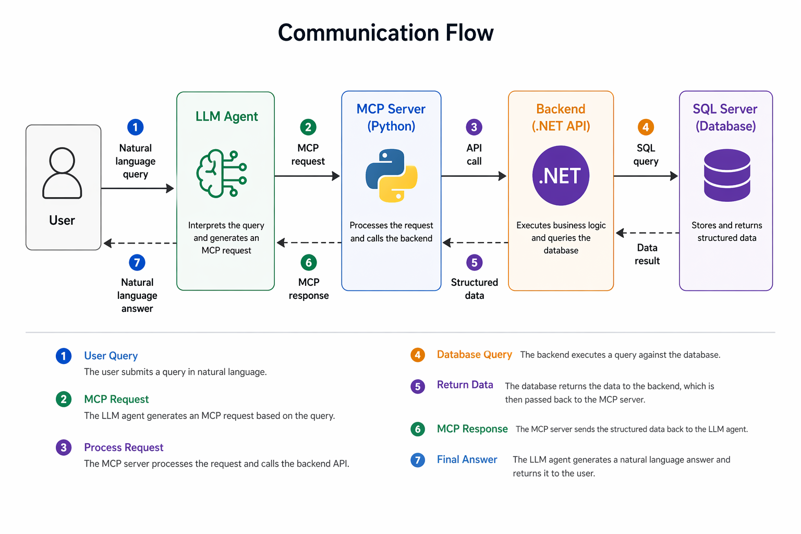
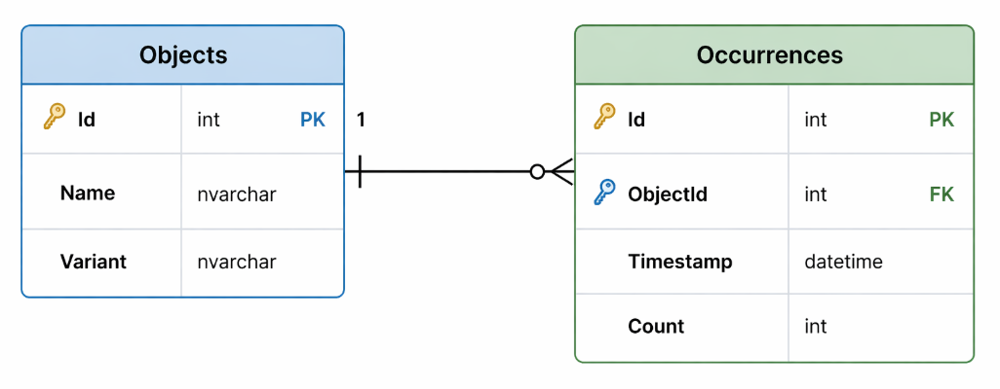

# Object Detection MCP Server

This project is a demonstration application for working with data produced by a camera capable of detecting objects in space. The application consists of an API and an MCP server that enables querying this data using an LLM request.

##  Architecture Overview

The system consists of the following main components:

1. Database (Microsoft SQL Server)
    - Stores structured data about detected objects
    - Contains test data simulating camera outputs
2. Backend (.NET – ASP.NET Core Web API)
    - Provides access to the data
    - Implements business logic and aggregations
    - Returns structured responses for the MCP layer
3. MCP Server (Python)
    - Acts as a middleware between the LLM agent and the backend
    - Implements MCP endpoints
    - Translates LLM requests into backend queries
4. LLM Agent (external)
    - Communicates via MCP protocol
    - Translates natural language into structured queries
    - Not part of this implementation (integration only)

## Communication Flow

## Technologies
- Backend: .NET 10 (ASP.NET Core Web API)
- MCP Server: Python 3.14.3
- Database: Microsoft SQL Server 15.0.

## Data Model

## MCP Interface

- Retrieve occurrences with filters based on datetime range, object name and variant.
- Total number of occurrences object in datetime range.
- List of most frequest objects in datetime range.

## Running the project

1. Run SQL script for creating database and tables with demo data.
2. Run .NET API (`dotnet run --project BE/WebAPI/WebAPI/WebAPI.csproj`)
3. Set MCP server (`MCP\main.py`)

    - download Claude desktop app
    - set absolute path for `tools.json` in `MCP\main.py`
    - set MCP server in _Settings -> Developer_
    - restart app

4. Open Claude and start a new chat. Make sure that the recognition MCP server is running.
5. Put the questions:
    - _Kolikrát jsi viděl hrnek včera?_
    - _Který objekt se za poslední týden opakvoval nejčastější?_
    - _Co jsi viděl v pondělí?_

